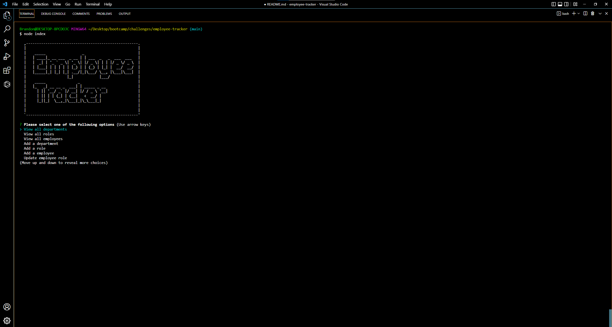

# employee-tracker

---

This app is an example of a command terminal program that helps the user manage their business by enabling them to add employees, departments, roles, and view them in a small, easy to use interface. The program uses multiple node packages including: inquierer, mysql2, path, util, asciiart-logo, console.table, and dotenv.

## Requirements

---

```md
GIVEN a command-line application that accepts user input
WHEN I start the application
THEN I am presented with the following options: view all departments, view all roles, view all employees, add a department, add a role, add an employee, and update an employee role
WHEN I choose to view all departments
THEN I am presented with a formatted table showing department names and department ids
WHEN I choose to view all roles
THEN I am presented with the job title, role id, the department that role belongs to, and the salary for that role
WHEN I choose to view all employees
THEN I am presented with a formatted table showing employee data, including employee ids, first names, last names, job titles, departments, salaries, and managers that the employees report to
WHEN I choose to add a department
THEN I am prompted to enter the name of the department and that department is added to the database
WHEN I choose to add a role
THEN I am prompted to enter the name, salary, and department for the role and that role is added to the database
WHEN I choose to add an employee
THEN I am prompted to enter the employee’s first name, last name, role, and manager, and that employee is added to the database
WHEN I choose to update an employee role
THEN I am prompted to select an employee to update and their new role and this information is updated in the database
```

## Usage

---

To use the application, the user must first navigate to the application directory in their command terminal. Once in the correct directory, the user must then perform a npm install command in the terminal. This command will install all needed packages. Allowing the program to run as designed. After performing the npm install, the user must navigate to the db file, and then perform a mysql -u root -p command. Once entering their password, the user must perform a SOURCE schema.sql command in the terminal. This will allow mysql to create the needed database. For the demonstration purposes, there is a seed.sql file that can be ran if the user wants to have some demonstration information to view before starting. After sourcing the schema, the user must exit out of mysql by executing a quit command. After navigating back to the root of the directory, the user will only need to run a node index.js command in the terminal, this will start the program, presenting the user with options that include: viewing all employees, viewing all roles, viewing all departments, adding a department, adding a role, and adding an employee. There is also an option to exit the program.

## Challenges in development

---

The main challenge in the development of this program, were getting all of the acceptance criteria to be met. There are still a couple of bugs, to where the contents of the table will be covered up when the user uses the arrow keys to make a new selection. Getting the list of employees, roles, and departments to render as choices in inquirer was also a challenge for me, but with the help of my instruction team, I was able to sucessfully do this.

## Screenshot

---



## Demonstration video

---

[Here is a link to the demonstration video for this program](https://drive.google.com/file/d/1Zl1-kj19jIwWVI5HMotAtQD3ZKExwccD/view?usp=sharing)

## GitHub Repo

---

[Here is the link to the GitHub repository for this project](https://github.com/brandonelliott0530/employee-tracker)

## Contact Me

---

Email: brandonelliott0594@gmail.com

GitHub: https://github.com/brandonelliott0530
